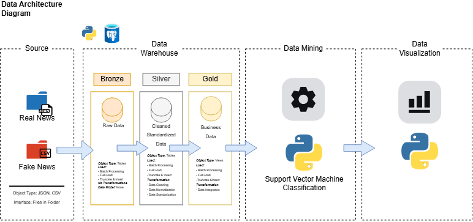
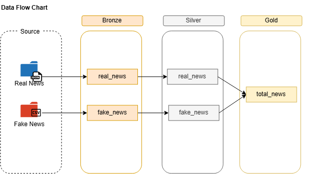

# News Classification Data Pipeline

An end-to-end data pipeline implementing Medallion Architecture (Bronze, Silver, Gold) in PostgreSQL with Python for ingesting, cleaning, and preparing real and fake news datasets for downstream classification and sentiment analysis.

## Architecture



The system consists of four main stages:

1. **Source**: Raw files (`data/fake.csv`, `data/News_Category_Dataset_v3.json`).
2. **Data Warehouse (PostgreSQL)**:
   - **Bronze (Raw)**: Raw tables (`real_news`, `fake_news`). Full load batch ingestion with no transformation.
   - **Silver (Cleaned)**: Standardized tables with cleaned text, normalized author fields, and parsed dates.
   - **Gold (Business / Integrated)**: Integrated layer (`total_news`) combining cleaned sources for downstream consumption.
3. **Data Mining (Python)**: News classification and sentiment analysis.
4. **Data Visualization (Python)**: Exploratory data analysis and model performance reporting.

## Data Flow



## Project Structure

```
├── data/                    # Source datasets (fake.csv, News_Category_Dataset_v3.json)
├── docs/                    # Architecture diagrams and logs
├── scripts/
│   ├── bronze/              # Database connection and bronze ingestion scripts
│   ├── silver/              # Silver DDL and stored procedure for data cleaning
│   └── gold/                # Gold layer integration scripts
├── init_db.sql              # Database and schema initialization script
├── requirements.txt         # Python package dependencies
├── .envexample              # Environment variable template
└── README.md                # Project documentation
```

## Setup

1. **Install Dependencies**:

   ```bash
   pip install -r requirements.txt
   ```

2. **Configure Environment Variables**:
   Copy `.envexample` to `.env` and configure credentials:

   ```env
   PG_USERNAME=postgres
   PG_PASSWORD=your_password
   PG_HOST=localhost
   PG_PORT=5432
   PG_DATABASE=news_mining
   ```

3. **Initialize Database and Schemas**:
   ```bash
   psql -U postgres -f init_db.sql
   ```

## Execution

1. **Bronze Ingestion (Python)**:

   ```bash
   python scripts/bronze/ingest_fake_news.py
   python scripts/bronze/ingest_real_news.py
   ```

2. **Silver Transformation (PostgreSQL)**:
   Create silver tables and stored procedure:
   ```bash
   psql -U postgres -d news_mining -f scripts/silver/ddl_silver.sql
   psql -U postgres -d news_mining -f scripts/silver/proc_load_silver.sql
   ```
   Execute the procedure:
   ```sql
   CALL silver.load_silver();
   ```

## Datasets

- `fake.csv`: Fake news dataset containing text and metadata tagged as questionable/misleading.
- `News_Category_Dataset_v3.json`: Real news category dataset from HuffPost (2012-2022).

## AI Acknowledgment

Project documentation, diagram integration, and code comments were authored with the assistance of AI (Google Antigravity).
