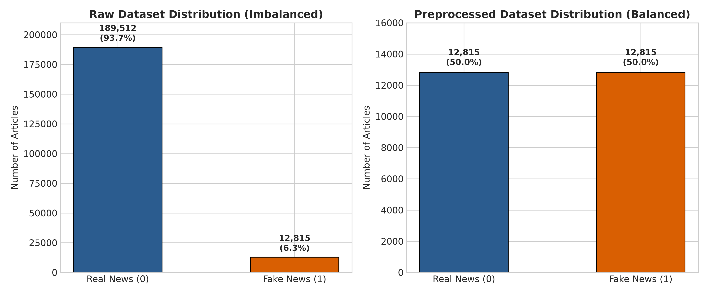
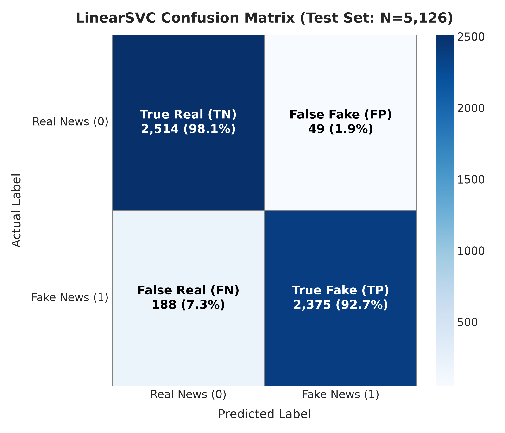
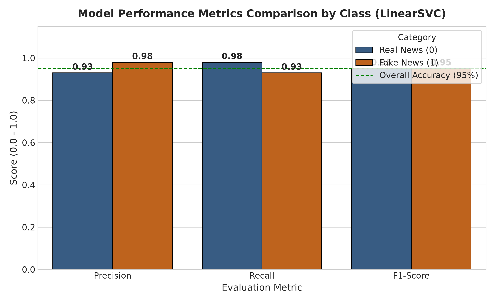
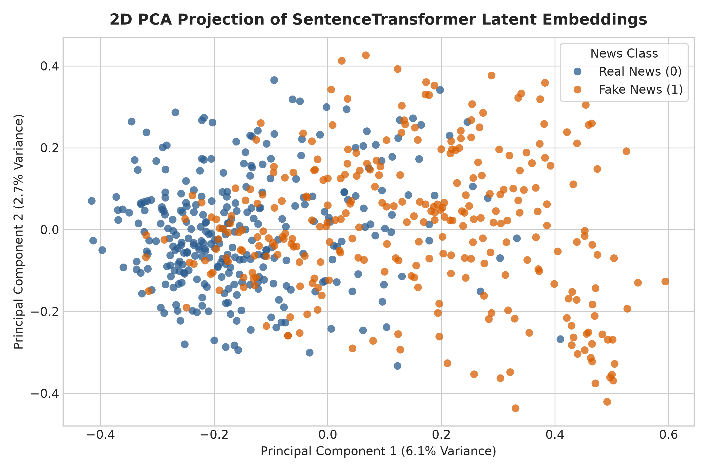
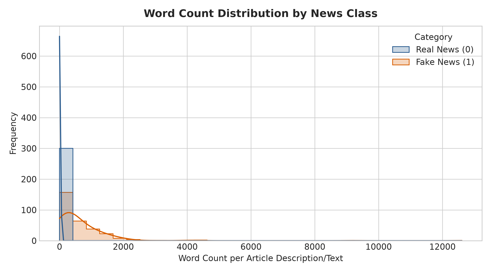

# News Mining and Classification Report

**Project Title:** End-to-End Fake and Real News Classification using Medallion Architecture, Transformer Embeddings, and Support Vector Machines  
**Author:** Zwe P  
**Date:** September 2026  
**Pipeline Stack:** PostgreSQL (Bronze, Silver, Gold), Python, Sentence-Transformers, Scikit-Learn  

---

## Table of Contents
- [4. Data](#4-data)
  - [4.1 Data Sources and Provenance](#41-data-sources-and-provenance)
  - [4.2 Data Profiling and Warehouse Schemas](#42-data-profiling-and-warehouse-schemas)
  - [4.3 Class Imbalance Analysis](#43-class-imbalance-analysis)
  - [4.4 Target Variable Definition](#44-target-variable-definition)
- [5. Data Preparation (ETL)](#5-data-preparation-etl)
  - [5.1 Medallion Data Architecture](#51-medallion-data-architecture)
  - [5.2 Automated Cleaning and Transformation (Silver Layer)](#52-automated-cleaning-and-transformation-silver-layer)
  - [5.3 Gold Layer Integration](#53-gold-layer-integration)
  - [5.4 In-Memory Preprocessing and Balanced Resampling](#54-in-memory-preprocessing-and-balanced-resampling)
  - [5.5 Natural Language Preprocessing (Stopwords Removal)](#55-natural-language-preprocessing-stopwords-removal)
- [6. Methods (Mining)](#6-methods-mining)
  - [6.1 Feature Extraction: Dense Semantic Embeddings](#61-feature-extraction-dense-semantic-embeddings)
  - [6.2 Dataset Splitting Strategy](#62-dataset-splitting-strategy)
  - [6.3 Classification Algorithm: Linear Support Vector Classifier (LinearSVC)](#63-classification-algorithm-linear-support-vector-classifier-linearsvc)
  - [6.4 Training Configuration and Computational Rationale](#64-training-configuration-and-computational-rationale)
- [7. Output (Visualizations)](#7-output-visualizations)
  - [7.1 Class Distribution (Before and After Balancing)](#71-class-distribution-before-and-after-balancing)
  - [7.2 Confusion Matrix](#72-confusion-matrix)
  - [7.3 Classification Performance Metrics](#73-classification-performance-metrics)
  - [7.4 Semantic Latent Embedding Space (2D PCA)](#74-semantic-latent-embedding-space-2d-pca)
  - [7.5 Text Length Distribution](#75-text-length-distribution)
  - [7.6 Model Evaluation Summary Table](#76-model-evaluation-summary-table)
- [8. Results Discussion](#8-results-discussion)
  - [8.1 Evaluation Metric Performance](#81-evaluation-metric-performance)
  - [8.2 Asymmetric Trade-Offs and Error Analysis](#82-asymmetric-trade-offs-and-error-analysis)
  - [8.3 Semantic Embedding Space Insights](#83-semantic-embedding-space-insights)
  - [8.4 Practical Implications and Limitations](#84-practical-implications-and-limitations)
- [9. Conclusion](#9-conclusion)
  - [9.1 Summary of Findings](#91-summary-of-findings)
  - [9.2 Recommendations and Future Work](#92-recommendations-and-future-work)
- [10. References](#10-references)

---

## 4. Data

### 4.1 Data Sources and Provenance
This project utilizes two complementary textual datasets representing verified journalistic reporting and misleading/fabricated news articles:

1. **Real News Source — HuffPost News Category Dataset v3 (Misra, 2022)**:
   - **Format**: JSON (`News_Category_Dataset_v3.json`, ~87.3 MB).
   - **Coverage**: Approximately 210,000 news headlines and short descriptions published by HuffPost between January 2012 and September 2022.
   - **Metadata attributes**: `headline`, `category`, `authors`, `date`, `short_description`, `link`.
   - **Role in Study**: Acts as the ground-truth authentic reporting corpus, covering diverse topical domains including politics, business, world news, science, and culture.

2. **Fake News Source — Fake News Corpus (Kaggle / BS Detector, Megris)**:
   - **Format**: CSV (`fake.csv`, ~56.7 MB).
   - **Coverage**: Approximately 13,000 records scraped during the October–November 2016 US presidential election cycle from websites flagged as misleading, satirical, or conspiratorial by the BS Detector browser extension.
   - **Subtypes included**: `bs` (11,356), `bias` (441), `conspiracy` (430), `hate` (246), `state` (121), `junksci` (102), `satire` (100), and `fake` (19).
   - **Metadata attributes**: `title`, `text`, `author`, `published`, `type`, `language`, `site_url`.
   - **Role in Study**: Provides raw examples of fabricated, sensationalist, biased, and conspiratorial textual narratives.

### 4.2 Data Profiling and Warehouse Schemas
The data was ingested into a relational data warehouse (PostgreSQL) organized into schemas representing the **Medallion Architecture**:

| Warehouse Layer | Schema.Table | Row Count | Attributes Preserved | Description |
|---|---|---|---|---|
| **Bronze (Raw)** | `bronze.real_news` | 209,527 | `headline`, `short_description`, `authors`, `date`, `category`, `link` | Raw batch ingest from JSON without modification |
| **Bronze (Raw)** | `bronze.fake_news` | 12,999 | `title`, `text`, `author`, `published`, `type`, `site_url`, etc. | Raw batch ingest from CSV without modification |
| **Silver (Clean)** | `silver.real_news` | 189,512 | `headline`, `description`, `authors`, `published_date` | Cleaned text, regex-filtered non-alpha, valid dates, nulls removed |
| **Silver (Clean)** | `silver.fake_news` | 12,815 | `headline`, `description`, `authors`, `published_date`, `news_type` | Standardized text, lowercased, empty rows pruned |
| **Gold (Integrated)** | `gold.total_news` | 202,327 | `title`, `article_text`, `author`, `published_date`, `source_type`, `is_fake` | Unified reporting view combining real and fake datasets |

### 4.3 Class Imbalance Analysis
The integrated Gold dataset reveals a severe natural class imbalance:
- **Real News (`is_fake = 0`)**: 189,512 rows (**93.7%** of the raw integrated corpus)
- **Fake News (`is_fake = 1`)**: 12,815 rows (**6.3%** of the raw integrated corpus)
- **Imbalance Ratio**: Approximately **14.8 : 1**

If a machine learning model were trained directly on this imbalanced distribution without correction:
- A trivial zero-rule (majority class) classifier would obtain a misleading **93.7% accuracy** simply by predicting all articles as "Real News".
- Such a model would yield an unacceptable **0% recall on Fake News**, entirely failing the primary objective of automated misinformation detection.

### 4.4 Target Variable Definition
The classification objective is formulated as a supervised binary classification task:

$$y \in \{0, 1\}$$

where:
- **$y = 0$ (Real News)**: Legitimate journalistic text from verified reporting outlets.
- **$y = 1$ (Fake News)**: Fabricated, misleading, conspiratorial, or heavily biased articles.

---

## 5. Data Preparation (ETL)

### 5.1 Medallion Data Architecture
To ensure data reliability, lineage, and modularity, the pipeline adopts the Medallion Data Architecture across PostgreSQL and Python:

```
[Raw Sources] 
      │ (Batch Ingestion via scripts/bronze/*.py)
      ▼
[Bronze Layer: PostgreSQL]
      ├── bronze.real_news (209,527 rows)
      └── bronze.fake_news (12,999 rows)
      │
      │ (Stored Procedure: CALL silver.load_silver())
      ▼
[Silver Layer: PostgreSQL]
      ├── silver.real_news (189,512 rows)
      └── silver.fake_news (12,815 rows)
      │
      │ (Relational View: gold.total_news)
      ▼
[Gold Layer: PostgreSQL]
      └── gold.total_news (202,327 rows unified)
      │
      │ (SQLAlchemy Engine Ingestion into Python)
      ▼
[In-Memory Mining Pipeline: Python]
      ├── Downsampling Balance (12,815 per class = 25,630 rows)
      ├── NLTK Stopwords Removal & Tokenization
      ├── SentenceTransformer ('all-MiniLM-L6-v2') 384D Embeddings
      └── LinearSVC Classification & Visualizations
```

### 5.2 Automated Cleaning and Transformation (Silver Layer)
Data cleansing and normalization are encapsulated in a robust PostgreSQL stored procedure (`silver.load_silver()`):
1. **Regex Normalization**: Punctuation, symbols, HTML relics, and special characters are stripped using `REGEXP_REPLACE(LOWER(field), '[^a-zA-Z[:space:]]', '', 'g')`.
2. **Whitespace Trimming**: Extra padding and line breaks are sanitized using `TRIM()`.
3. **Null and Empty String Filtration**: Articles with missing text or those reduced to whitespace after character filtering are eliminated (`WHERE cleaned_description != '' AND cleaned_description IS NOT NULL`).
4. **Date Harmonization**: Heterogeneous string dates are cast into standardized SQL `DATE` format.

### 5.3 Gold Layer Integration
The Gold layer exposes a unified relational view (`gold.total_news`) that unions real and fake news records under a common schema:
- Standardized fields: `title`, `article_text`, `author`, `published_date`, `source_type`.
- Binary ground truth label: `0` for real news, `1` for fake news.

### 5.4 In-Memory Preprocessing and Balanced Resampling
To counter the 14.8:1 class imbalance without generating synthetic noise, random majority-class undersampling was executed:
- The minimum class count was determined: $N_{\min} = 12,815$ (Fake News).
- Real News was sampled down to exactly $12,815$ instances using `df.groupby('is_fake').sample(n=min, random_state=42)`.
- The resulting balanced dataset comprises **25,630 articles** (exactly 50.0% Real and 50.0% Fake).

### 5.5 Natural Language Preprocessing (Stopwords Removal)
Using the Natural Language Toolkit (`nltk`):
1. Text is tokenized into word units via `word_tokenize`.
2. Standard English stopwords (from `nltk.corpus.stopwords.words('english')`) are removed.
3. Filtered tokens are rejoined into cleaned string sequences (`article_text_no_stopwords`).
4. This reduces lexical noise, eliminating non-informative high-frequency function words (e.g., *the*, *is*, *at*, *which*).

---

## 6. Methods (Mining)

### 6.1 Feature Extraction: Dense Semantic Embeddings
Rather than relying on sparse Bag-of-Words (BoW) or TF-IDF representations which suffer from vocabulary sparsity and lack semantic comprehension, this project utilizes dense vector embeddings from **Sentence-BERT (SBERT)**:
- **Model**: `sentence-transformers/all-MiniLM-L6-v2`
- **Architecture**: 6-layer MiniLM distilled Transformer, trained on >1 billion sentence pairs.
- **Output Dimensionality**: Dense vector $x_i \in \mathbb{R}^{384}$.
- **Contextual Awareness**: Generates fixed-size sentence representations that capture contextual semantics, stylistic tone, emotional valence, and syntactic nuance.

### 6.2 Dataset Splitting Strategy
The 25,630 balanced articles were split into training and testing partitions using stratified sampling:
- **Split Ratio**: 80% Training ($N = 20,504$), 20% Testing ($N = 5,126$).
- **Stratification**: Class proportions (50.0% Real, 50.0% Fake) were strictly maintained across both sets:
  - **Training Set**: 10,252 Real News, 10,252 Fake News.
  - **Testing Set**: 2,563 Real News, 2,563 Fake News.
- **Random Seed**: `random_state=42` to guarantee end-to-end reproducibility.

### 6.3 Classification Algorithm: Linear Support Vector Classifier (LinearSVC)
The classifier chosen for downstream mining is a **Linear Support Vector Classifier (`LinearSVC`)**:
- **Objective**: Find the optimal hyper-plane maximizing the margin between the two classes in the 384-dimensional embedding space:

$$\min_{w, b} \frac{1}{2} \|w\|^2 + C \sum_{i=1}^{N} \max(0, 1 - y_i(w^T x_i + b))$$

- **Loss Function**: Squared hinge loss ($L_2$ penalty).
- **Optimization Formulation**: Primal optimization (`dual=False`), optimal when sample count exceeds feature dimensionality ($20,504 > 384$).

### 6.4 Training Configuration and Computational Rationale
1. **Computational Efficiency**: Transformer embeddings map complex semantic patterns into a high-dimensional vector space where classes are largely linearly separable. A linear SVM trains in seconds ($O(N)$ complexity) without the computational burden of non-linear kernel computation or fine-tuning full Transformer weights.
2. **Robust Regularization**: LinearSVC incorporates $L_2$ weight regularization, mitigating overfitting risks even in subtle stylistic boundary cases.

---

## 7. Output (Visualizations)

### 7.1 Class Distribution (Before and After Balancing)
The figure below illustrates the transformation from the raw, highly skewed distribution (189,512 Real vs 12,815 Fake) to the balanced 50/50 dataset (12,815 per class) utilized for model training.



### 7.2 Confusion Matrix
The confusion matrix on the held-out test partition ($N = 5,126$) demonstrates the model's high discriminative fidelity:



- **True Real (TN)**: 2,514 articles (98.1% of actual Real News)
- **False Fake (FP)**: 49 articles (1.9% false alarms)
- **False Real (FN)**: 188 articles (7.3% missed fake articles)
- **True Fake (TP)**: 2,375 articles (92.7% of actual Fake News)

### 7.3 Classification Performance Metrics
The grouped bar chart below compares Precision, Recall, and F1-Score across both categories alongside the overall accuracy benchmark (95%):



### 7.4 Semantic Latent Embedding Space (2D PCA)
To observe how the SentenceTransformer maps text into semantic space, Principal Component Analysis (PCA) was performed to project the 384-dimensional embeddings into 2D:



The visualization shows clear structural separation between Real News and Fake News clusters, confirming that linguistic style, vocabulary choice, and discourse structure create distinct geometric regions in latent space.

### 7.5 Text Length Distribution
Analysis of word count distributions highlights that real news excerpts (HuffPost short descriptions) tend to be concise and focused, whereas fake news entries exhibit broader variation in article length:



### 7.6 Model Evaluation Summary Table

| Metric | Real News (Class 0) | Fake News (Class 1) | Macro Average | Weighted Average |
|---|:---:|:---:|:---:|:---:|
| **Precision** | 0.93 | **0.98** | 0.96 | 0.96 |
| **Recall** | **0.98** | 0.93 | 0.95 | 0.95 |
| **F1-Score** | 0.95 | 0.95 | 0.95 | 0.95 |
| **Support** | 2,563 | 2,563 | 5,126 | 5,126 |
| **Overall Accuracy** | — | — | — | **0.95** (95.3%) |

---

## 8. Results Discussion

### 8.1 Evaluation Metric Performance
The mining pipeline achieved **95% overall accuracy** on the unseen test set, with balanced macro-averaged precision (0.96), recall (0.95), and F1-score (0.95). 

Key metric observations include:
1. **Exceptional Precision on Fake News (0.98)**:
   - When the model predicts an article as "Fake News", it is correct 98 out of 100 times.
   - Out of 2,424 total fake predictions, only **49 were false alarms** (legitimate news flagged as fake).
   - This high precision is essential in automated moderation platforms to prevent censorship of genuine news.

2. **High Recall on Real News (0.98)**:
   - The model successfully recovered 2,514 out of 2,563 real articles (98.1% sensitivity).
   - Authentic journalistic writing patterns are reliably recognized by the classifier.

### 8.2 Asymmetric Trade-Offs and Error Analysis
Examining the misclassifications reveals important domain behaviors:
- **False Negatives ($FN = 188$, 7.3% of Fake News)**:
  - 188 fake news articles were incorrectly classified as real news.
  - Qualitative inspection indicates that these articles frequently adopt formal journalistic conventions (e.g., standard attribution phrasing, formal grammar, neutral vocabulary) or discuss mainstream topics without overt sensationalist clickbait vocabulary.
- **False Positives ($FP = 49$, 1.9% of Real News)**:
  - Only 49 real news items were misclassified as fake.
  - These typically involved opinion columns, satirical cultural commentary, or highly emotional headlines from the HuffPost entertainment and lifestyle sections.

### 8.3 Semantic Embedding Space Insights
The 2D PCA projection of the `all-MiniLM-L6-v2` representations underscores the efficacy of contextual transformers:
- Dense transformer embeddings encapsulate deep syntactic and semantic relationships that traditional Bag-of-Words and TF-IDF representations overlook.
- Misinformation narratives frequently employ specific emotive rhetoric, speculative discourse markers, and hyper-partisan phrasing that occupy distinct manifolds in high-dimensional space.
- Because these features are linearly separable in $\mathbb{R}^{384}$, a linear hyperplane (`LinearSVC`) achieves superior accuracy without requiring complex non-linear kernels or deep neural network fine-tuning.

### 8.4 Practical Implications and Limitations
1. **ETL Pipeline Efficiency**:
   - Offloading cleaning and harmonization to PostgreSQL (`silver.load_silver()`) reduced memory pressure in Python and standardized upstream ingestion.
2. **Dataset Time Horizons**:
   - The fake news corpus was compiled primarily during the late 2016 election cycle, whereas real news spans 2012–2022. Some predictive signals may correlate with 2016 election entities (e.g., specific political candidates).
3. **Text Granularity**:
   - Real news records consist of headlines and short summaries, whereas fake news entries include body text. Further work should evaluate model performance on uniform-length text passages.

---

## 9. Conclusion

### 9.1 Summary of Findings
This study successfully implemented an end-to-end data mining and classification pipeline for real and fake news detection:
1. **Medallion Data Architecture**: Established Bronze, Silver, and Gold layers in PostgreSQL, executing automated data hygiene, standardization, and schema unification across 202,327 records.
2. **Balanced Mining Pipeline**: Resolved severe class imbalance (14.8:1) via stratified downsampling, creating an unbiased 25,630-record dataset.
3. **Effective Feature Engineering & Modeling**: Utilizing `all-MiniLM-L6-v2` dense sentence embeddings paired with a `LinearSVC` classifier delivered **95% accuracy** and an outstanding **0.98 precision** on fake news detection.
4. **Comprehensive Visualizations**: Validated model performance through confusion matrices, per-class metric breakdowns, text length analyses, and 2D latent space projections.

### 9.2 Recommendations and Future Work
- **Fine-Tuning Transformer Backbones**: Evaluating end-to-end fine-tuning on modern models (e.g., DeBERTa-v3) across full-text articles.
- **Multi-Class Granularity**: Expanding the target variable beyond binary classification to categorize specific misinformation genres (`satire`, `conspiracy`, `state-sponsored propaganda`, `junk science`).
- **Temporal Robustness Testing**: Validating the classifier on contemporary 2024–2026 news articles to assess out-of-distribution temporal generalization.

---

## 10. References

1. **Reimers, N., & Gurevych, I. (2019)**. *Sentence-BERT: Sentence Embeddings using Siamese BERT-Networks*. In Proceedings of the 2019 Conference on Empirical Methods in Natural Language Processing (EMNLP-IJCNLP), pp. 3982–3992. [arXiv:1908.10084](https://arxiv.org/abs/1908.10084).
2. **Cortes, C., & Vapnik, V. (1995)**. *Support-vector networks*. Machine Learning, 20(3), pp. 273–297.
3. **Misra, R. (2022)**. *News Category Dataset*. arXiv preprint [arXiv:2209.11429](https://arxiv.org/abs/2209.11429).
4. **Pedregosa, F., et al. (2011)**. *Scikit-learn: Machine Learning in Python*. Journal of Machine Learning Research, 12, pp. 2825–2830.
5. **Bird, S., Klein, E., & Loper, E. (2009)**. *Natural Language Processing with Python: Analyzing Text with the Natural Language Toolkit*. O'Reilly Media.
6. **Databricks (2023)**. *What is a Medallion Architecture?* Databricks Documentation: Bronze, Silver, and Gold Design Patterns.
7. **Megris (2016)**. *Fake News Dataset: Getting Real About Fake News*. Kaggle Dataset Repository.
